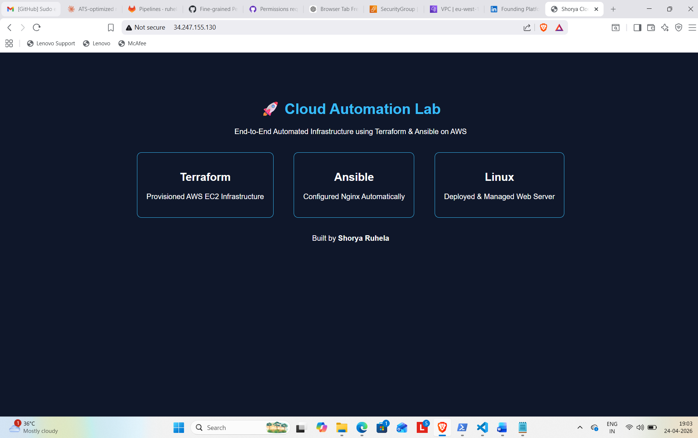
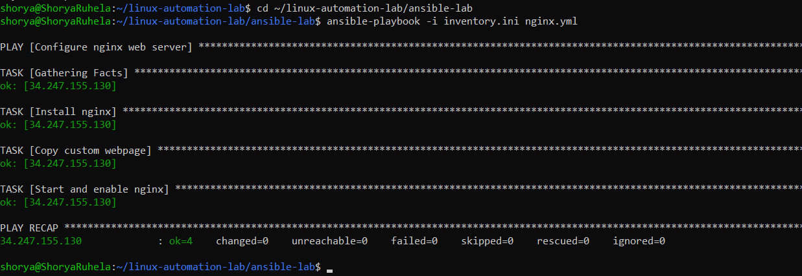

# 🚀 Cloud Automation Lab

End-to-End Infrastructure Automation using Terraform, Ansible & GitHub Actions on AWS.

## 🔧 Tech Stack
- AWS EC2
- Terraform (Infrastructure as Code)
- Ansible (Configuration Management)
- GitHub Actions (CI/CD)
- Linux & Nginx

## ⚙️ Workflow
1. Push code to GitHub
2. GitHub Actions triggers pipeline
3. Terraform provisions EC2
4. Ansible configures Nginx
5. Website deployed automatically

## 📸 Screenshots

